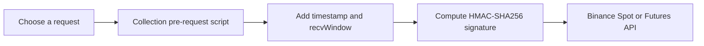

# Binance Postman API Kit

A ready-to-import Postman collection and environment for the Binance Spot,
Margin, Wallet, and USDM Futures REST APIs, with request signing fully
automated via a collection-level pre-request script — set your API
key/secret and start calling signed endpoints immediately.

## At a Glance

| Item | Included |
|---|---|
| Configured requests | 44 |
| API surfaces | Spot, Margin, Wallet/SAPI, User Data Stream, USDM Futures |
| Public requests | Market data and service metadata |
| Private requests | Account, wallet, margin, order, and futures operations |
| Authentication | Automatic HMAC-SHA256 signing plus `X-MBX-APIKEY` |
| Postman format | Collection schema v2.1 |

## Table of Contents

- [Overview](#overview)
- [Binance API Details](#binance-api-details)
- [Getting Started](#getting-started)
- [Auth Automation](#auth-automation)
- [Available Endpoints](#available-endpoints)
- [Contributing](#contributing)
- [License](#license)
- [Resources](#resources)

## Overview

This repository packages Binance's public REST APIs into a single Postman
collection (`Binance.postman_collection.json`) and a companion environment
(`Binance.postman_environment.json`) covering Spot trading, Margin, Wallet
(SAPI), the Spot User Data Stream, and USDM Futures — both public
market-data endpoints and private, signed account/trading endpoints. The
collection's pre-request script handles HMAC-SHA256 request signing for you,
so you can go from import to a working signed request in minutes.

## Binance API Details

- **Base URLs**:
  - Spot: `https://api.binance.com`
  - USDM Futures: `https://fapi.binance.com`
- **Authentication**: Private endpoints use HMAC-SHA256 query/body signing.
  Every signed request needs a `timestamp`, an optional `recvWindow`, and a
  `signature` computed over the request's parameters using your API secret,
  plus an `X-MBX-APIKEY` header carrying your API key. See
  [Auth Automation](#auth-automation) below for how this collection handles
  that automatically.
- **Rate limits**: Binance enforces rate limits that vary per endpoint
  (weight-based limits, order-count limits, and IP-based limits). Rather
  than restate numbers that change over time, consult the official docs
  directly: [Spot API rate limits](https://binance-docs.github.io/apidocs/spot/en/#limits)
  and the [Futures USDM API docs](https://binance-docs.github.io/apidocs/futures/en/)
  for futures-specific limits.

## Getting Started

### Prerequisites

- [Postman](https://www.postman.com/downloads/) desktop or web client.
- A Binance account with an API key and secret created for the endpoints you
  intend to use (see Binance's own docs for how to create API keys with the
  correct permissions).

### Installation

1. Import `Binance.postman_collection.json` into Postman
   (File → Import, or drag-and-drop).
2. Import `Binance.postman_environment.json` the same way.
3. In Postman's environment selector (top right), select the imported
   Binance environment.
4. Open the environment and set `apiKey` and `apiSecret` to your own
   credentials — for example `apiKey = YOUR_API_KEY` and
   `apiSecret = YOUR_API_SECRET`. Never commit real values for these fields;
   the environment file ships them empty on purpose.
5. Send a request. Public endpoints work immediately; signed endpoints work
   as soon as `apiKey`/`apiSecret` are set, with no further configuration.

## Auth Automation

You do not need to open the collection's script to use it, but here is
exactly what it does, so you always know what's happening under the hood.

The collection has a single **collection-level pre-request script** that
runs before every request in the collection:

1. **Detects whether the request needs signing.** It checks whether the
   outgoing request already has a `signature` or `timestamp` parameter in
   its query string, or a `signature`/`timestamp` field in an urlencoded
   body. If none of these are present, the script does nothing further and
   the request is sent as-is — this is how public endpoints (e.g. under
   `Spot - Public`) stay untouched.
2. **Injects `timestamp` and `recvWindow`.** For requests that do need
   signing, it sets `timestamp` to the current time and `recvWindow` to the
   value from the environment (defaulting to `5000` if unset).
3. **Builds the exact query string to sign**, in the order Binance expects:
   existing query parameters (excluding any pre-existing `signature`), then
   `timestamp` and `recvWindow` if not already present, then any urlencoded
   body parameters for POST/PUT-style signed requests.
4. **Computes the signature.** It runs `CryptoJS.HmacSHA256(queryString,
   apiSecret)` using the `apiSecret` value from your environment and encodes
   the result as hex. If `apiSecret` is empty, it logs a console warning
   instead of failing silently.
5. **Attaches the signature to the request.** For `GET`/`DELETE` requests,
   it appends the full signed query string (including `signature`) to the
   URL. For other methods, it sets the request body to `urlencoded` mode
   and populates it with the signed parameters.
6. **Sends the API key.** Separately from the script, the collection's
   authentication is configured as Postman's built-in API Key auth type,
   set to add header `X-MBX-APIKEY` with value `{{apiKey}}` — inherited by
   every request in the collection automatically.

Net effect: fill in `apiKey`/`apiSecret` once in the environment, and every
signed request in the collection authenticates correctly without any manual
signature computation.

## Available Endpoints

The collection is organized into 7 folders:

- **Spot - Public** — Spot market data that needs no authentication (order
  book, recent trades, klines, ticker prices, exchange info, and similar).
- **Spot - Signed** — Authenticated Spot trading and account endpoints
  (placing/cancelling orders, account balances, order history) that require
  HMAC-signed requests.
- **Spot - User Data Stream** — Endpoints for creating, keeping alive, and
  closing a `listenKey`-based user data stream (used for WebSocket account
  updates); authenticated via API key rather than HMAC signing.
- **Wallet (SAPI)** — Account/wallet-level operations under Binance's SAPI
  surface (deposits, withdrawals, account status, and related wallet data).
- **Margin (SAPI)** — Margin account trading and account-management
  endpoints under SAPI.
- **Futures UM - Public** — USDM (USDT-margined) Futures market data that
  needs no authentication.
- **Futures UM - Signed (USER_TRADE)** — Authenticated USDM Futures trading
  and account endpoints requiring HMAC-signed requests.

## Project Status

The collection JSON and environment validate successfully with `jq` and ship
without credentials. Binance changes API contracts and rate limits over time,
so compare high-risk trading or withdrawal requests with the current official
documentation before use.

This repository is part of the
[Crypto API Postman toolkit](https://github.com/nima-mokhtarian?tab=repositories),
alongside collections for CoinGecko, CryptoQuant, CoinEx, Bitquery, Derive,
Nobitex, and multi-chain wallet history.

## Contributing

Contributions are welcome. If you find an endpoint that's missing, out of
date, or incorrectly documented, please open an issue or merge/pull request.
When editing the collection or environment JSON directly, validate your
changes with `jq . <file>` before submitting to confirm the file is still
valid Postman v2.1 schema JSON, and never include a real API key or secret
in any example, screenshot, or committed file.

## License

This project is licensed under the MIT License — see [LICENSE](./LICENSE)
for the full text.

## Resources

- [Binance Spot API docs](https://binance-docs.github.io/apidocs/spot/en/) —
  official documentation for Spot, Margin, and Wallet (SAPI) endpoints.
- [Binance Futures API docs](https://binance-docs.github.io/apidocs/futures/en/) —
  official documentation for USDM Futures endpoints.
- [Postman documentation](https://learning.postman.com/docs/getting-started/introduction/) —
  general getting-started guide for using Postman itself.
